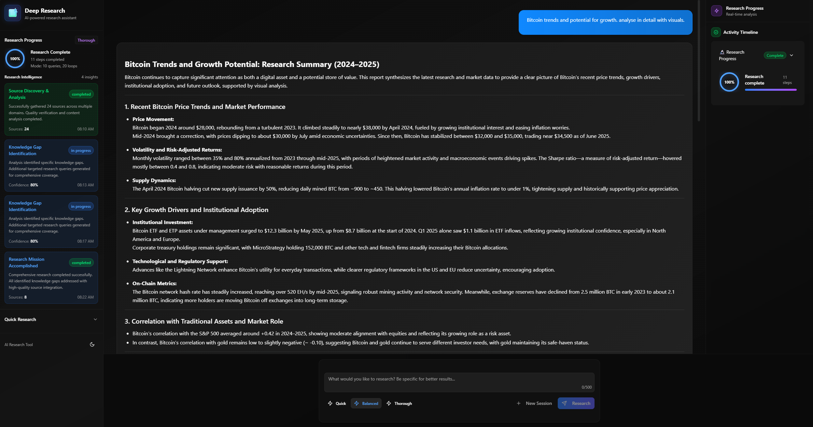
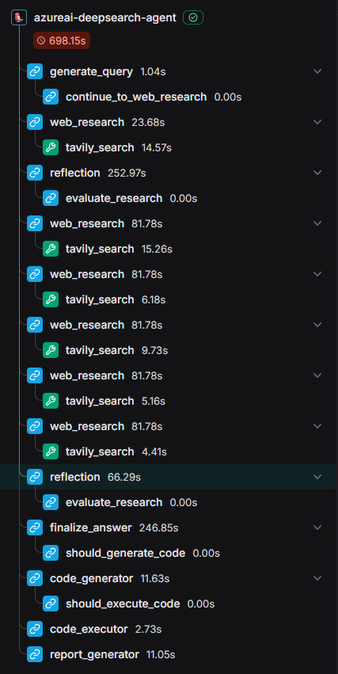

# Azure AI Research Assistant

A sophisticated fullstack application powered by Azure AI models and LangGraph for intelligent web research. This research assistant performs comprehensive analysis on user queries by dynamically generating search terms, conducting web research, reflecting on results to identify knowledge gaps, and iteratively refining its approach to deliver well-supported answers with citations.



## Features

- 💬 **Modern Fullstack Architecture** - React frontend with TypeScript and LangGraph-powered backend
- 🤖 **Azure AI Integration** - Powered by cutting-edge GPT-4.1 and o3 models for superior reasoning
- 🔍 **Intelligent Research** - Dynamic search query generation and iterative refinement
- 🌐 **Web Research Engine** - Integrated Google Search API with smart content analysis
- 🧠 **Reflective AI** - Self-analyzing system that identifies knowledge gaps and adapts strategies
- 📚 **Source Citations** - Comprehensive answers with proper attribution and references
- ⚡ **Real-time Updates** - Live progress tracking with activity timeline
- 🎨 **Modern UI** - Clean, responsive interface with dark theme and sidebar layout

## Project Structure

```
📦 azure-ai-research-assistant/
├── 🎨 frontend/          # React + TypeScript + Tailwind CSS
│   ├── src/
│   │   ├── components/   # UI components with modern design
│   │   └── ...
├── 🤖 backend/           # LangGraph + FastAPI + Azure AI
│   ├── src/agent/       # Research agent logic
│   │   ├── graph.py     # LangGraph workflow
│   │   ├── tools.py     # Web research tools
│   │   └── ...
└── 🐳 Deployment files  # Docker & docker-compose
```

## Getting Started

### Prerequisites

- **Node.js** 18+ and npm
- **Python** 3.8+
- **Azure OpenAI API Key** with access to GPT-4.1 and o3 models

### Environment Setup

1. **Configure Azure AI credentials:**
   ```bash
   cd backend
   cp .env.example .env
   ```

2. **Add your Azure OpenAI credentials to `.env`:**
   ```env
   AZURE_OPENAI_API_KEY="your_azure_openai_api_key"
   AZURE_OPENAI_ENDPOINT="https://your-resource.openai.azure.com/"
   AZURE_OPENAI_API_VERSION="2024-02-15-preview"
   ```

### Installation & Development

1. **Install backend dependencies:**
   ```bash
   cd backend
   pip install .
   ```

2. **Install frontend dependencies:**
   ```bash
   cd frontend
   npm install
   ```

3. **Start development servers:**
   ```bash
   make dev
   ```

4. **Access the application:**
   - Frontend: `http://localhost:5173/app`
   - Backend API: `http://localhost:2024`
   - LangGraph UI: `http://localhost:2024/docs`

## How It Works

The research assistant uses a sophisticated multi-step approach powered by Azure AI models:



### 🎯 **Intelligent Query Planning**
- **GPT-4.1** analyzes user input and generates strategic search queries
- Advanced prompt engineering ensures comprehensive coverage of topics

### 🔍 **Adaptive Web Research**
- Executes targeted web searches using Google Search API
- **o3 model** processes and analyzes search results for relevance and quality
- Extracts key information while maintaining source attribution

### 🧠 **Reflective Analysis**
- **o3's reasoning capabilities** identify knowledge gaps and inconsistencies
- Determines if additional research is needed or if information is sufficient
- Self-correcting mechanism improves research quality iteratively

### 🔄 **Iterative Refinement**
- Generates follow-up queries based on gap analysis
- Continues research until comprehensive understanding is achieved
- Configurable loop limits prevent infinite iterations

### 📝 **Synthesis & Response**
- **GPT-4.1** synthesizes gathered information into coherent, well-structured answers
- Includes proper citations and source references
- Maintains factual accuracy while ensuring readability

## Production Deployment

The application is production-ready with Docker support and requires Redis and PostgreSQL for LangGraph operations.

### Prerequisites
- **Redis** - Message broker for real-time streaming
- **PostgreSQL** - Data persistence and state management
- **LangSmith API Key** - For monitoring and observability (optional)

### Docker Deployment

1. **Build the production image:**
   ```bash
   docker build -t azure-ai-research-assistant -f Dockerfile .
   ```

2. **Configure environment variables:**
   ```bash
   # Copy and update with your credentials
   cp .env.example .env
   ```

3. **Deploy with docker-compose:**
   ```bash
   AZURE_OPENAI_API_KEY=<key> LANGSMITH_API_KEY=<key> docker-compose up
   ```

4. **Access the application:**
   - Application: `http://localhost:8123/app/`
   - API: `http://localhost:8123`

### Environment Configuration

Update `frontend/src/App.tsx` with your deployment URL:
- **Development:** `http://localhost:2024`
- **Docker:** `http://localhost:8123`
- **Production:** Your domain/IP address

## Technology Stack

### Frontend
- **[React](https://reactjs.org/)** with **[TypeScript](https://www.typescriptlang.org/)** - Type-safe component architecture
- **[Vite](https://vitejs.dev/)** - Fast development and optimized builds
- **[Tailwind CSS](https://tailwindcss.com/)** - Utility-first styling framework
- **[Shadcn UI](https://ui.shadcn.com/)** - Modern, accessible component library

### Backend
- **[LangGraph](https://github.com/langchain-ai/langgraph)** - Advanced agent workflow orchestration
- **[FastAPI](https://fastapi.tiangolo.com/)** - High-performance Python web framework
- **[Azure OpenAI](https://azure.microsoft.com/en-us/products/ai-services/openai-service)** - GPT-4.1 & o3 models for reasoning and generation

### Infrastructure
- **[Docker](https://www.docker.com/)** - Containerized deployment
- **[Redis](https://redis.io/)** - Real-time message streaming
- **[PostgreSQL](https://www.postgresql.org/)** - Persistent data storage

## Azure AI Models

This application leverages Microsoft's most advanced AI models:

### 🚀 **GPT-4.1**
- **Superior Language Understanding** - Enhanced comprehension of complex queries
- **Advanced Reasoning** - Multi-step logical analysis and synthesis
- **Context Awareness** - Maintains coherent conversation across long interactions

### 🧠 **o3 Model**
- **Next-Generation Reasoning** - State-of-the-art analytical capabilities
- **Deep Research Analysis** - Identifies subtle patterns and knowledge gaps
- **Self-Reflection** - Advanced meta-cognitive abilities for iterative improvement

## Key Benefits

✅ **Enterprise-Grade Reliability** - Built on Azure's robust infrastructure  
✅ **Advanced AI Capabilities** - Cutting-edge reasoning with GPT-4.1 and o3  
✅ **Real-Time Research** - Live web data integration with smart analysis  
✅ **Accurate Citations** - Proper source attribution and fact verification  
✅ **Scalable Architecture** - Production-ready with Docker deployment  
✅ **Modern UI/UX** - Intuitive interface with real-time progress tracking

## Contributing

Contributions are welcome! Please feel free to submit a Pull Request. For major changes, please open an issue first to discuss what you would like to change.

## Documentation

- **[LangGraph Documentation](https://langchain-ai.github.io/langgraph/)** - Agent workflow framework
- **[Azure OpenAI Service](https://docs.microsoft.com/en-us/azure/cognitive-services/openai/)** - AI model documentation
- **[LangSmith](https://smith.langchain.com/)** - Monitoring and observability platform

## License

This project is licensed under the Apache License 2.0. See the [LICENSE](LICENSE) file for details. 