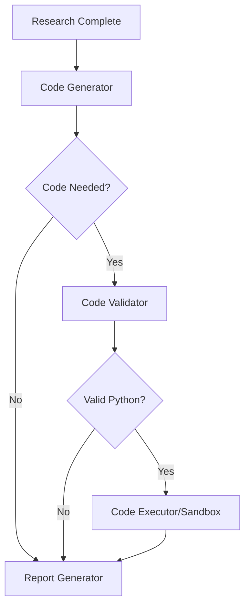

# Enhanced Code Generation and Execution Separation

This document describes the enhanced architecture that ensures a clear separation between code generation (LLM-based) and code execution (sandboxed), with strict validation that only actual Python code gets sent to the execution sandbox.

## Architecture Overview

The agent now follows a strict separation principle:

1. **Code Generator Node**: Uses LLM to analyze research content and decide if computational analysis is needed
2. **Code Validator**: Validates that generated content is actual executable Python code
3. **Code Executor Node**: Only receives and executes validated Python code in a sandbox
4. **Intelligent Routing**: Routes based on code presence and validation results

## Key Principles

### 1. Computational Analysis Decision Making

The `code_generator` node makes intelligent decisions about when code is truly needed:

**Code IS needed for:**
- Mathematical calculations, statistical analysis, or complex data processing
- Data visualization of numerical data (charts, graphs, plots)
- Financial modeling, trend analysis, or quantitative comparisons
- Scientific calculations or engineering computations
- Data parsing/processing from specific formats (CSV, JSON, APIs)

**Code IS NOT needed for:**
- Simple text summaries or basic research synthesis
- Conceptual analysis or qualitative insights
- Basic fact compilation or information organization
- General research that doesn't involve computation

### 2. Code Validation Pipeline

Before any content reaches the execution sandbox, it goes through multiple validation layers:

```python
def _is_actual_python_code(code_content: str) -> bool:
    """Validate that the provided content is actual executable Python code."""
    # 1. Check for Python syntax indicators
    # 2. Validate syntax compilation
    # 3. Ensure it's not just text or comments
```

### 3. Sandbox Protection

Only validated Python code reaches the execution environment:



## Implementation Details

### Code Generator Node

```python
def code_generator(state: OverallState, config: RunnableConfig) -> OverallState:
    # 1. Analyze research content
    # 2. Make intelligent decision about computational needs
    # 3. Generate Python code only if truly beneficial
    # 4. Validate generated code before marking for execution
```

Key features:
- Conservative approach: most research doesn't need code
- Clear rationale for decisions
- Structured JSON response format
- Multiple validation checkpoints

### Code Executor Node

```python
def code_executor(state: OverallState, config: RunnableConfig) -> OverallState:
    # 1. Verify Python code is present
    # 2. Validate code is actual Python (double-check)
    # 3. Send ONLY validated code to sandbox
    # 4. Handle execution results and errors
```

Key features:
- Multiple validation gates
- Clear logging of what gets sent to sandbox
- Robust fallback handling
- Structured result processing

### Routing Logic

```python
def should_execute_code(state: OverallState, config: RunnableConfig) -> str:
    # Only route to execution if:
    # 1. Code analysis was marked as needed
    # 2. Actual Python code was generated
    # 3. Code passes validation checks
```

## Configuration Options

### Azure Container Apps Dynamic Sessions

```yaml
# Environment variables for Azure sessions
AZURE_POOL_MANAGEMENT_ENDPOINT=your-endpoint
AZURE_SESSIONS_NO_AUTH=true  # For public endpoints
```

### Agent Configuration

```python
Configuration(
    enable_code_interpreter=True,      # Enable/disable code features
    use_azure_sessions=True,          # Use Azure sessions vs subprocess
    code_interpreter_model="gpt-4o"   # Model for code generation
)
```

## Testing and Validation

Use the provided test script to validate the separation:

```bash
cd backend
python test_code_separation.py
```

This tests:
1. Code generation decisions for different query types
2. Python code validation function
3. Proper routing based on code presence
4. Sandbox execution only for validated code

## Security Considerations

### Sandbox Isolation

- Code execution happens in isolated Azure Container Apps sessions
- Fallback to subprocess with safety checks
- No persistent state between executions

### Code Validation

- Syntax validation before execution
- Content type validation (Python vs text)
- Size and complexity limits

### Error Handling

- Graceful fallback when Azure sessions unavailable
- Clear error messages without exposing internals
- Robust recovery from validation failures

## Best Practices

### For Code Generation

1. **Be Conservative**: Only generate code when computational analysis adds clear value
2. **Validate Early**: Check code validity before marking for execution
3. **Clear Rationale**: Always provide reasoning for code generation decisions
4. **Self-Contained**: Generate code that runs independently with proper imports

### For Code Execution

1. **Validate Inputs**: Double-check that only Python code reaches the sandbox
2. **Handle Errors**: Gracefully handle execution failures
3. **Structured Output**: Return results in consistent format
4. **Security First**: Never execute unvalidated content

## Monitoring and Debugging

### Logging Points

- Code generation decisions and rationale
- Code validation results
- Sandbox execution attempts
- Routing decisions

### Debug Information

- Code preview before execution
- Validation failure reasons
- Execution method used (Azure vs subprocess)
- Error details for troubleshooting

## Example Workflows

### Computational Analysis Required

```
Query: "Analyze solar energy ROI trends with specific calculations"
↓
Research: Gather data about solar energy ROI
↓
Code Generator: "Code needed for financial calculations and trend visualization"
↓
Generated Code: Python code for ROI calculations and matplotlib charts
↓
Code Validator: Validates Python syntax and content
↓
Code Executor: Executes in Azure Container Apps sandbox
↓
Report Generator: Integrates code results into final report
```

### Conceptual Research Only

```
Query: "What are the main challenges in renewable energy adoption?"
↓
Research: Gather qualitative information
↓
Code Generator: "No computational analysis needed for conceptual research"
↓
Report Generator: Create report from research content only
```

This architecture ensures that computational resources are used efficiently and that the sandbox environment only receives validated, executable Python code.
